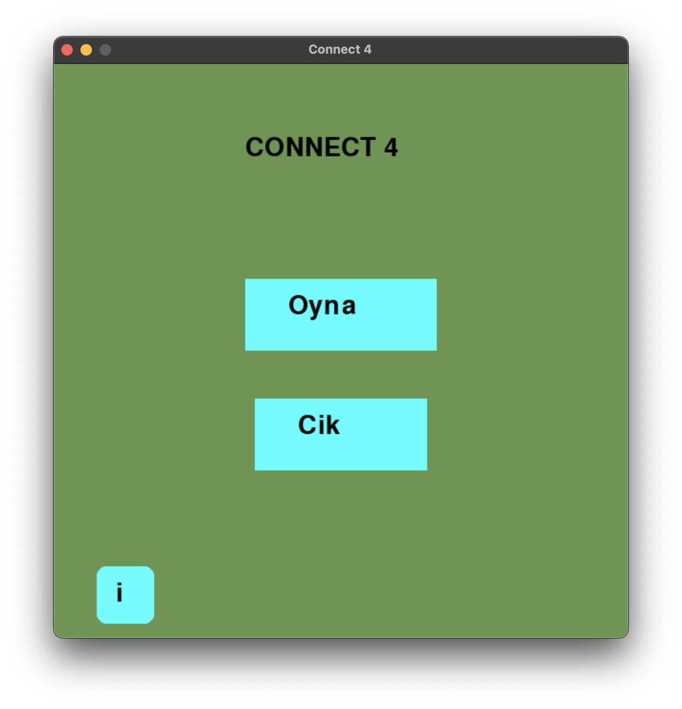
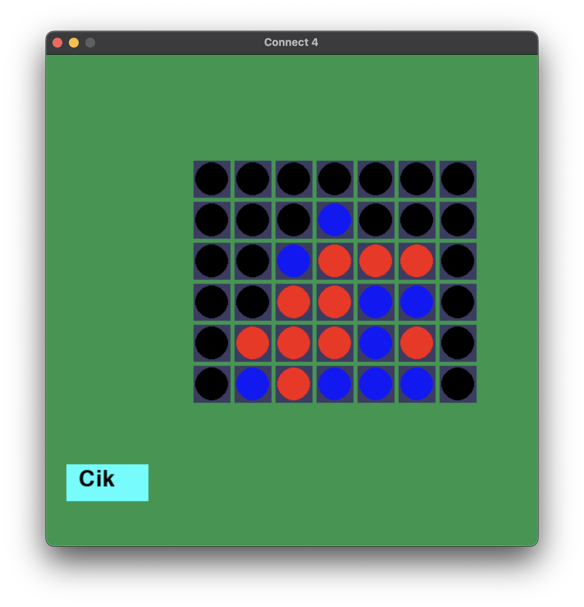

# 🎮 CONNECT 4 MASTER 🎮

<div align="center">
  
  **An exciting two-player strategy game that challenges your tactical thinking!**
  
  *Originally developed as a high school preparatory project - June 12, 2022*
  
  [](https://opensource.org/licenses/MIT)
  [](https://www.python.org/downloads/)
  [](https://www.pygame.org/)
</div>

## 🎯 About The Game
**Connect 4 Master** is a classic strategy game I created during my high school preparatory year in 2022. The game features a vertical grid where players take turns dropping colored discs from the top. The objective is simple yet challenging: be the first to form a horizontal, vertical, or diagonal line of four discs of your color.

> *"Plan your moves, block your opponent, and connect four to win!"*

## 📋 How to Play
<div align="center">
  
</div>

### Rules:
1. **Two players** take turns dropping colored discs into the grid
2. **Player 1** uses red discs, **Player 2** uses blue discs
3. **First player** to connect four of their discs horizontally, vertically, or diagonally wins
4. If the grid fills completely with no winner, the game ends in a **draw**

<details>
<summary><b>🔍 Tip: Strategic Thinking</b></summary>
<br>
Consider these strategies to improve your game:
<ul>
<li>Control the center columns when possible - they offer more connecting possibilities</li>
<li>Block your opponent when they have three in a row</li>
<li>Try to create multiple threats simultaneously</li>
<li>Look several moves ahead - anticipate your opponent's strategy</li>
</ul>
</details>

## 📚 Project Background
This game was developed during my high school preparatory year as part of my programming curriculum. I started working on it on June 12, 2022, to apply what I had learned about:
- Python programming fundamentals
- Game development with Pygame
- GUI design principles
- Two-player interaction mechanics
- Win condition algorithms

## ⚙️ Installation
```bash
# 1. Make sure Python is installed on your system
# 2. Install Pygame:
pip install pygame
# 3. Clone this repository:
git clone https://github.com/yourusername/connect4-master.git
cd connect4-master
# 4. Run the game
python main.py
```

## 🌟 Features
| Feature | Description |
|---------|-------------|
| 🎨 **Colorful Interface** | Visually appealing game board with distinctive player colors |
| 🖱️ **Easy Controls** | Simple click-to-play mechanics |
| 🏆 **Win Detection** | Automatic detection of winning combinations |
| 📱 **Responsive Design** | Adapts to different screen resolutions |
| 🔄 **Play Again Option** | Quickly start a new game after finishing |

## 🎯 Game Controls
- **Mouse Click**: Select a column to drop your disc
- **Menu Navigation**: Interactive buttons for game options
- **Exit Button**: Return to main menu or quit game

## 🏠 User Interface
<div align="center">
  
</div>

The game features an intuitive user interface with:
- A welcoming start screen
- Clear game instructions
- Distinctive colored discs for each player
- Visual feedback for game progress and wins
- Easy navigation between screens

## 🚀 Development Journey
Starting with basic programming knowledge, I developed this game to challenge myself and learn more about interactive application development. The project evolved from a simple assignment into a polished game that taught me valuable lessons about user interface design and game logic implementation.

## 📝 License
This project is licensed under the [MIT License](LICENSE).

---
<div align="center">
  
  **🎮 Connect 4 Master - A Python implementation using Pygame 🎮**
  
  **Originally developed as a high school preparatory project - June 12, 2022**
  
  [🐛 Report Bug](https://github.com/yourusername/connect4-master/issues) | [🔄 Submit PR](https://github.com/yourusername/connect4-master/pulls) | [⭐ Star](https://github.com/yourusername/connect4-master)
  
</div>
